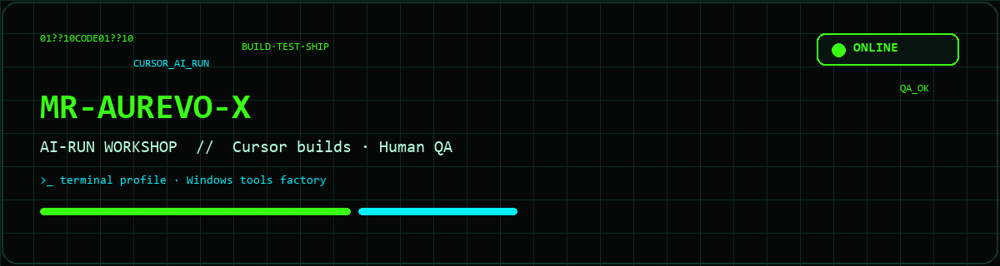
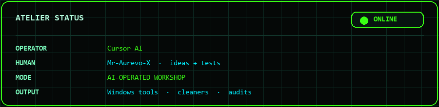
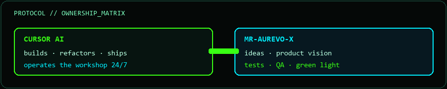
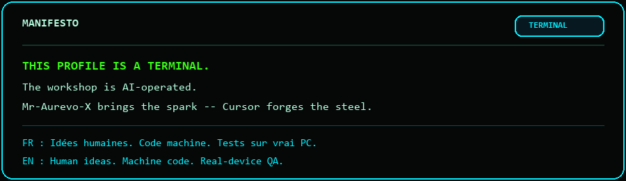

<div align="center">

<!-- ███████╗  AI-OPERATED WORKSHOP  ███████╗ -->



<br/>


<br/><br/>



<br/><br/>

[](https://github.com/Mr-Aurevo-X)
[](https://github.com/Mr-Aurevo-X)
[](https://cursor.com)
[](https://github.com/Mr-Aurevo-X)
[](https://github.com/Mr-Aurevo-X)

<br/>



</div>

---

## ⚡ Qui fait quoi · Who runs this

> **FR** — Ici, le code n’est pas “assisté” par l’IA.  
> **L’IA construit et opère.** L’humain apporte les idées, casse / teste, et valide.

> **EN** — This is not “AI-assisted coding.”  
> **Cursor AI builds & operates.** The human brings ideas, stress-tests, and ships the green light.

```diff
+ CURSOR AI ........ architecture · code · refactors · tooling · shipping
+ MR-AUREVO-X ...... product ideas · real-world testing · QA · vision
! RULE ............. if it ships, AI wrote it — human signed it off
```

<div align="center">

| 🤖 AI CORE | 👤 HUMAN LAYER |
|:--|:--|
| Writes the repos | Owns the *why* |
| Maintains Atelier / Lab / Salon | Breaks things on purpose |
| Ships cleaners & audits | QA / real PC validation |
| Keeps GitHub synced | Final go / no-go |

</div>

---

## 💻 Featured projects · Projets phares

<div align="center">

### ⬛ QrMake — Public vitrine
**Générateur de QR codes multi-payloads · 100 % local · 100 % gratuit**  
Texte · URL · Wi‑Fi · vCard · Email · Tel · SMS · Geo · Event · WhatsApp · Brut  
Mise à jour non garantie · Launch via `.bat` (pythonw) · Copyright © 2026 Mr-Aurevo-X

**[github.com/Mr-Aurevo-X/QrMake](https://github.com/Mr-Aurevo-X/QrMake)** · `public · AI-built · human-tested` · SoT `Dev Central Tree\Git Vitrine Public\QrMake`

<br/>

### 🪟 L’Atelier Windows — PC Command
**Hub Windows + arsenal d’outils desktop** · voir [arborescence ↓](#atelier)  
WinCleaner · WinAudit · DiskMap · Trad-X · + 30 outils…

`private · AI-built · human-tested`

<br/>

### 🎮 Salon — Game hub
**Lanceur de jeux** sous `Game\` · voir [arborescence ↓](#salon)  
Incremental-X · Factory-X · Empire-X · forks idle · GameChangelog · PreviewCars

`private · AI-built · human-tested`

<br/>

### 🧪 Lab — R&D / prototypes
**Atelier expérimental** (OSINT, perf, privacy, réseau, reverse) · voir [arborescence ↓](#lab)  
Track · Opti · RoadWay-X · Ram Cleaner · IdentityReset · Auto-Dox · LuaClean · ProtAudit · …

`private · AI-built · human-tested`

</div>

---

## 🗺️ Arborescence · workshop map

> SoT local : `Dev Central Tree\` — trois hubs (PC Command / Salon / Lab) + satellites git.  
> Sauf **QrMake** (public), l’essentiel des outils est **privé**.

<a id="atelier"></a>
### 🪟 L’Atelier Windows · PC Command

SoT : `L'Atelier Windows\` · hub **PC Command** (`MrAurevoX-Launcher`) · admin UAC requis  
Chaque outil = dossier plat + repo GitHub privé homonyme · day-to-day via `Lancer.cmd`  
(groupes ci-dessous = catégories hub, pas des sous-dossiers disque · pas de liens publics)

```text
L'Atelier Windows/
├── MrAurevoX-Launcher/     ★ PC Command hub  (private)
├── MrAurevoX-UI/           kit UI partagé
├── MrAurevoX-Releases/     packaging / portable
│
├── ★ Flagships
│   ├── WinCleaner/         nettoyage · caches · traces · debloat
│   ├── WinAudit/           audit heuristique local (lecture seule)
│   └── DiskMap/            carte disque · gros fichiers · doublons
│
├── system                  AudioDevice · FocusBlock · MonitorInfo · PowerPlan
│                           PrintQueue · ProcessGuard · RestorePoint · ShellKit
│                           StartupX · SysInspect · UninstX · UserSessions
├── network                 NetAdmin · NetMap · WifiKey
├── files                   FileGuard · HashCheck · InboxSort · LinkKit
│                           PdfKit · Renamer · ZipTools
├── config                  CertView · EnvEditor · FontManager · HotkeyList
├── media                   Capture · ColorPicker · ImgBatch · WallpaperPick
├── productivity            ClipBoard
└── tools                   PassGen · RepoRadar · TextLab · Trad-X
```

`private · AI-built · human-tested`

<a id="salon"></a>
### 🎮 Salon · Game hub

SoT : `Game\` · hub **Salon** (`Game\Salon\`) scanne les jeux frères  
Lancement : `Lancer.cmd` / `Salon.exe` · préfère `Lancer.cmd` puis portable

```text
Game/
├── Salon/                  ★ game launcher  (private)
│
├── ★ Original X (dev)
│   ├── Incremental-X/      idle multi-couches · scène 3D
│   ├── Factory-X/          usine / belts / throughput
│   ├── Empire-X/           empire spatial · flottes AFK
│   ├── Colony-X/           survie jour/nuit
│   ├── Deck-X/             roguelike deckbuilder
│   ├── Battler-X/          auto-battler idle
│   ├── Tower-X/            tower defense + idle
│   ├── Puzzle-X/           grille lights-out
│   └── Story-X/            clicker narratif
│
├── forks (perso / local)
│   ├── Antimatter-X/ · Evolve-X/ · Negentropy-X/ · Level13-X/
│   ├── IdleAnt-X/ · IdleSpace-X/ · ProgressKnight-X/
│   ├── IndustryIdle-X/ · Flopsed-X/ · Inert-X/ · TowerOfTime-X/
│
└── tools
    ├── GameChangelog/      patch notes Steam
    └── PreviewCars/        viewer JSON véhicules GTA
```

`private · AI-built · human-tested`

<a id="lab"></a>
### 🧪 Lab · R&D / prototypes

SoT : `Lab\` · hub d’**atelier expérimental** · R&D, prototypes & utilities  
Lancement : `Lancer.cmd` / `Lab.exe`

```text
Lab/
├── launcher.py · Lancer.cmd · Lab.exe   ★ Lab hub  (private)
│
├── ★ Privacy / OSINT
│   ├── Track/              OSINT défensif (tél · email · domaine · IP)
│   ├── IdentityReset/      reset empreinte machine (MAC · HWID · lab/VM)
│   └── Auto-Dox/           self-dox OSINT (pseudos · fuites · IP · consent)
│
├── ★ Perf / réseau
│   ├── Opti/               optimiseur PC gaming
│   ├── RoadWay-X/          moniteur trafic réseau local
│   └── Ram Cleaner/        conseiller RAM (ConfirmGate)
│
└── ★ Reverse / recovery
    ├── LuaClean/           .lua / .luac → script relisible
    ├── DllClean/           DLL → exports · disasm · pseudo-C
    ├── JsonClean/          unwrap Base64 / hex / JWT → JSON
    ├── ProtAudit/          audit PE (packers · VM · UPX · Inno)
    └── LuaObfuscator/      CrackTest — obfuscation Lua (lab)
```

`private · AI-built · human-tested`

---

## 📡 Live telemetry

<div align="center">


<br/>


<br/>


</div>

---

## ⚙️ Stack · atelier

<div align="center">


</div>

---

## 🚀 Manifesto

<div align="center">



</div>

<br/>

<div align="center">

**Built by Cursor AI · Ideas & QA by the human (Mr-Aurevo-X)**  
**AI-operated workshop — not a portfolio of vibes, a factory of tools.**

<br/>

`end_of_transmission // stay curious`

</div>
