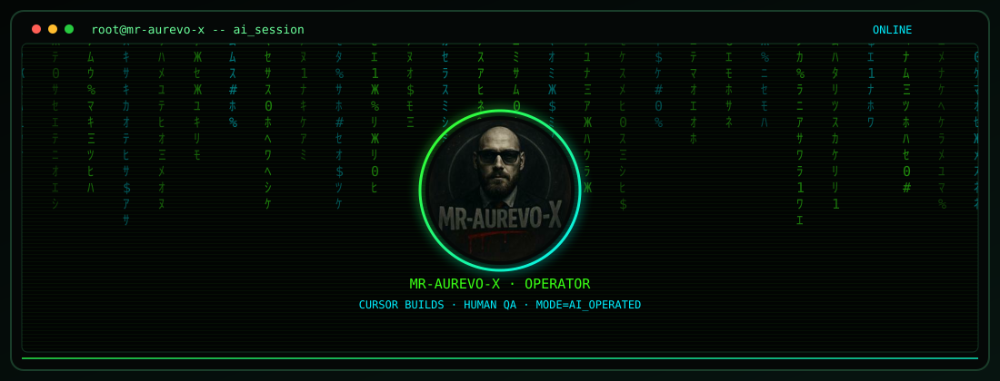

<div align="center">

# `>_ mr-aurevo-x@workshop:~`

<a href="#windows"></a>
<a href="#linux"></a>
<a href="#ia"></a>

</div>

<table>
<tr>
<td width="50%" valign="top">

**FR** — Atelier d’outils locaux. Cursor construit. Mr-Aurevo-X teste et valide.  
Gratuit · autant local que possible · sans compte.

</td>
<td width="50%" valign="top">

**EN** — Local-first tools workshop. Cursor builds. Mr-Aurevo-X QAs and signs off.  
Free · as local as possible · no account.

</td>
</tr>
</table>

---

<a id="windows"></a>

## Windows

<table>
<tr>
<td width="50%" valign="top">

### PC Command — c’est quoi

**PC Command**, c’est **4 hubs** (pas un seul .exe fourre-tout).  
Chaque hub = une fenêtre admin, modules du même thème, zip portable `Launch-Hub-*.zip`, UAC.  
**Autant local que possible** : pas de compte, pas de télémétrie ; la vérif de version GitHub est optionnelle / désactivable.

**Public** · PolyForm Noncommercial 1.0.0 · **v2.0.0**  
SmartScreen possible : binaires **non signés**.

</td>
<td width="50%" valign="top">

### PC Command — what it is

**PC Command** is **4 hubs** (not one kitchen-sink .exe).  
Each hub = one admin window, same-theme modules, portable zip `Launch-Hub-*.zip`, UAC.  
**As local as possible**: no account, no telemetry; GitHub version check is optional / can be turned off.

**Public** · PolyForm Noncommercial 1.0.0 · **v2.0.0**  
SmartScreen may appear: binaries are **unsigned**.

</td>
</tr>
</table>

| Hub | FR | EN | Visibilité / Visibility | Version |
|:--|:--|:--|:--|:--|
| [Système](https://github.com/Mr-Aurevo-X/Hub-Systeme) | ménage · RAM · process · désinstall | cleanup · RAM · processes · uninstall | **public** | [v2.0.0](https://github.com/Mr-Aurevo-X/Hub-Systeme/releases/tag/v2.0.0) |
| [Réseau](https://github.com/Mr-Aurevo-X/Hub-Reseau) | adaptateurs · carte · traffic · Wi‑Fi | adapters · map · traffic · Wi‑Fi | **public** | [v2.0.0](https://github.com/Mr-Aurevo-X/Hub-Reseau/releases/tag/v2.0.0) |
| [Sécurité](https://github.com/Mr-Aurevo-X/Hub-Securite) | FileGuard · CertView · RepoRadar · WinAudit | FileGuard · CertView · RepoRadar · WinAudit | **public** | [v2.0.0](https://github.com/Mr-Aurevo-X/Hub-Securite/releases/tag/v2.0.0) |
| [Utilitaires](https://github.com/Mr-Aurevo-X/Hub-Utilitaires) | UtilKit + MediaKit | UtilKit + MediaKit | **public** | [v2.0.0](https://github.com/Mr-Aurevo-X/Hub-Utilitaires/releases/tag/v2.0.0) |

### Standalones

| App | FR | EN | Visibilité / Visibility | Version |
|:--|:--|:--|:--|:--|
| [QrTools](https://github.com/Mr-Aurevo-X/QrTools) | QR simple + lot | simple + batch QR | **public** | v2.0.0 |
| [UnitConvert](https://github.com/Mr-Aurevo-X/UnitConvert) | unités + devises (BCE + cache offline) | units + currencies (ECB + offline cache) | **public** | v2.0.0 |
| [TimeTools](https://github.com/Mr-Aurevo-X/TimeTools) | horodatage · chrono · Pomodoro | timestamps · stopwatch · Pomodoro | **public** | v2.0.0 |
| [PixClean](https://github.com/Mr-Aurevo-X/PixClean) | strip EXIF / GPS / XMP | strip EXIF / GPS / XMP | **public** | v2.0.0 |
| [GameChangelog](https://github.com/Mr-Aurevo-X/GameChangelog) | patch notes Steam | Steam patch notes | **public** | v1.0.3 |
| [Game Lounge](https://github.com/Mr-Aurevo-X/Game-Lounge) | hub de jeux web (28 \*-X, site statique) | web game hub (28 \*-X, static site) | **privé** / **private** | — |
| [SoftTunes](https://github.com/Mr-Aurevo-X/SoftTunes) | prépa session + HUD FPS *(pas un booster)* | session prep + FPS HUD *(not a booster)* | **public** | v2.0.2 |
| [LocalDock](https://github.com/Mr-Aurevo-X/LocalDock) | racines de confiance · scan · loopback | trust roots · scan · loopback | **public** | v0.1.0 |

---

<a id="linux"></a>

## Linux

<table>
<tr>
<td width="50%" valign="top">

### Linux Command — c’est quoi

**Linux Command**, c’est le **commander / launcher optionnel** (Tauri) : grille des hubs, install copier-coller, vérif GitHub en lecture seule.  
Les hubs sont des **apps GTK 4 autonomes** — tu n’es pas obligé d’installer le launcher.

</td>
<td width="50%" valign="top">

### Linux Command — what it is

**Linux Command** is the **optional commander / launcher** (Tauri): hub grid, copy-paste install, read-only GitHub version check.  
Hubs are **standalone GTK 4 apps** — you don’t have to install the launcher.

</td>
</tr>
</table>

| App | FR | EN | Visibilité / Visibility | Version |
|:--|:--|:--|:--|:--|
| [Linux Command](https://github.com/Mr-Aurevo-X/Linux-Command) | launcher / commander (optionnel) | optional launcher / commander | **privé** / **private** | v0.2.0 |
| [Hub Système](https://github.com/Mr-Aurevo-X/Hub-Systeme-Linux) | santé · process · paquets · disques · journaux | health · processes · packages · disks · logs | **privé** / **private** | v1.0.0 |
| [Hub Réseau](https://github.com/Mr-Aurevo-X/Hub-Reseau-Linux) | interfaces · flotte · diagnostic | interfaces · fleet · diagnostics | **privé** / **private** | v1.0.0 |
| [Hub Sécurité](https://github.com/Mr-Aurevo-X/Hub-Securite-Linux) | audit · secrets · permissions | audit · secrets · permissions | **privé** / **private** | v1.0.0 |
| [Hub Utilitaires](https://github.com/Mr-Aurevo-X/Hub-Utilitaires-Linux) | search · hash · PDF · images · disk map | search · hash · PDF · images · disk map | **privé** / **private** | v1.0.0 |
| [Hub Dev](https://github.com/Mr-Aurevo-X/Hub-Dev-Linux) | loopback + ports locaux | loopback + local ports | **privé** / **private** | v1.0.0 |

### Standalones

| App | FR | EN | Visibilité / Visibility | Version |
|:--|:--|:--|:--|:--|
| [Crypto Tracker](https://github.com/Mr-Aurevo-X/crypto-tracker) | surveillance crypto **locale** — pas un exchange, pas d’achat/vente | **local** crypto watch — not an exchange, no buy/sell | **privé** (sources) · **binaires publics** / **private** (source) · **public binaries** | Flatpak [1.2.21](https://github.com/Mr-Aurevo-X/linux-flatpak-releases/releases/tag/crypto-tracker-v1.2.21) · native [1.2.17](https://github.com/Mr-Aurevo-X/linux-releases/releases/tag/crypto-tracker-v1.2.17) |
| [Game Lounge](https://github.com/Mr-Aurevo-X/Game-Lounge) | hub de jeux web (28 \*-X, site statique) | web game hub (28 \*-X, static site) | **privé** / **private** | — |

---

<a id="ia"></a>

## IA

<div align="center">



</div>

<table>
<tr>
<td width="50%" valign="top">

L’IA construit et opère. Mr-Aurevo-X apporte les idées, casse / teste, et valide.

</td>
<td width="50%" valign="top">

Cursor AI builds and operates. Mr-Aurevo-X brings ideas, stress-tests, and the green light.

</td>
</tr>
</table>

```diff
+ CURSOR ......... architecture, code, tooling, ship
+ MR-AUREVO-X .... idées, tests réels, QA, feu vert
! RÈGLE .......... si ça sort, l’IA l’a écrit — je l’ai validé
```

| Projet | FR | EN | Visibilité / Visibility | Version |
|:--|:--|:--|:--|:--|
| [FakeVPS](https://github.com/Mr-Aurevo-X/FakeVPS) | Ubuntu local style VPS | local Ubuntu VPS rehearsal | **public** | v1.0.0 |
| [Mr-X Sentinel](https://github.com/Mr-Aurevo-X/Mr-X-Sentinel) | bot Discord self-host | self-hosted Discord bot | **public** · figé / frozen | v2.0.0 |

---

## Sur mesure — Custom builds

`BY_REQUEST` | `AI_BUILT` | `HUMAN_QA` | `GITHUB_COMPLIANT` | `SCOPE_FIRST`

<table>
<tr>
<td width="50%" valign="top">

Logiciels **à la demande**, **toujours via IA**. Cursor construit · Mr-Aurevo-X cadre, teste et **valide**.  
Pas une presta « développeur humain au kilo ».

Périmètre : utilitaires desktop, outils locaux, scripts, intégrations légères.  
Conforme [ToS](https://docs.github.com/site-policy/github-terms/github-terms-of-service) / [AUP](https://docs.github.com/site-policy/acceptable-use-policies/github-acceptable-use-policy) / [Guidelines](https://docs.github.com/site-policy/github-terms/github-community-guidelines) — pas de malware, pas de crack / DRM, pas de spam.

Tout **repo public** reste **gratuit**. Le sur-mesure se discute en amont.

</td>
<td width="50%" valign="top">

**On-demand** software, **always AI-built**. Cursor builds · Mr-Aurevo-X scopes, tests, and **signs off**.  
Not a hired-dev-by-the-hour shop.

Scope: desktop utilities, local-first tools, scripts, light integrations.  
Stays within GitHub [ToS](https://docs.github.com/site-policy/github-terms/github-terms-of-service) / [AUP](https://docs.github.com/site-policy/acceptable-use-policies/github-acceptable-use-policy) / [Guidelines](https://docs.github.com/site-policy/github-terms/github-community-guidelines) — no malware, no cracks / DRM bypass, no spam.

Every **public repo** stays **free**. Custom work is agreed up front.

</td>
</tr>
</table>

```diff
+ MODEL .......... Cursor AI builds | Mr-Aurevo-X ideas + QA + sign-off
+ IN_SCOPE ....... desktop tools | admin helpers | local-first apps | Discord bots (compliant)
+ PROCESS ........ brief → feasibility → estimate → AI build → human QA → handoff
! OUT_OF_SCOPE ... cheats | cracks | spyware | ToS / AUP violations | "code only by hand / no AI"
```

| | FR | EN |
|:--|:--|:--|
| **Contact** | [Discord DM](https://discord.com/users/406891052516114442) — décrire le besoin | [Discord DM](https://discord.com/users/406891052516114442) — describe the use case |
| **Livraison / Delivery** | sources IA + chemin de build · QA Mr-Aurevo-X · repo privé ou public | AI-built sources + build path · Mr-Aurevo-X QA · private or public repo |
| **Stack** | Python · pywebview · PowerShell · GTK / Flatpak · Node / React | Python · pywebview · PowerShell · GTK / Flatpak · Node / React |
| **Engagement / Commitment** | pas d’engagement sans accord écrit | no commitment without a written agreement |

---

<div align="center">

[](https://discord.com/users/406891052516114442)
[](https://www.paypal.com/paypalme/aurevo1)
[](https://revolut.me/mr_aurevo_x)

**Built by Cursor AI · Ideas & QA by Mr-Aurevo-X**

`end_of_transmission // stay curious`

</div>
